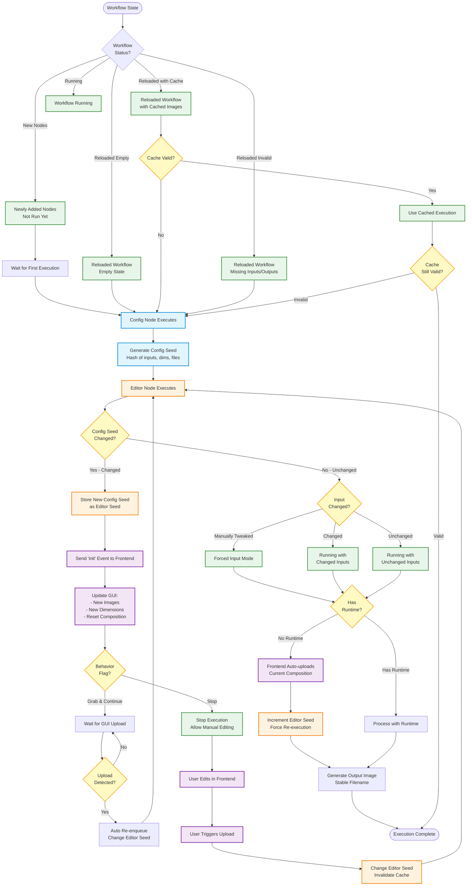

# nodes:

two nodes:
-config (provides input filenames and mask filenames, width, height and behavior flag and a seed representing these values, the seed is generated with random number anytime the node runs, comfy runs a node when one of it's widget value changes)

- editor (provides a gui to composes the input files withing a composition area defined by width and height, produces an image as output, the image content changes when the user interacts with frontend, the output name stays stable)

# change detection and flow logic

- the config provides a hash of its inputs, a config "seed"
- the editor checks if config seed changed , if changed the editor node needs to:
- whenever config seed changes the ui needs to receive an init event and adapt the gui
- update the gui with the changes (eg different input images, or dimensions, the provided seed is also stored as the editorìs own "seed" to ensure an execution is triggered)
- stop to allow the gui to upload the image (the editor can change it's own seed when the user modifies the composition in within the editor node)
- decide to continue (re-enqueue) automatically after a change is detected and a re-upload has happened.
- only the content of the editor composition change the file name will stay constant so other techniques like changing the editor seed is used to invalidate the comfy cache and re-evaluate the node.

- when the image has not changed and there is no "runtime"
- the frontend can upload the image autonoumosly so when running the node
- the seed of the editor is changed and the node re-runs

# possible states

- chached execution (comfy) of config or editor (how to invalidate)
- newly added nodes (not run)
- reloaded workflow (empty) : events ? known info ?
- reloaded wofklows (with cached images)
- reloaded workflow (with cached non existing inputs or outputs)
- running with changed inputs
- running with unchanged inputs
- running with manually tweaked editor inputs (forced input)

# flags

- behavior flag when config seed has changed: grab and continue / stop
- messaging "init" on changed config input

# Flow Diagram

## State Descriptions

### Initial States

1. **Newly Added Nodes**: Nodes just added to workflow, never executed
2. **Reloaded Workflow (Empty)**: Workflow loaded with no cached data
3. **Reloaded Workflow (Cached)**: Workflow loaded with valid cached images
4. **Reloaded Workflow (Invalid Cache)**: Workflow loaded but inputs/outputs missing

### Execution States

5. **Cached Execution**: ComfyUI using cached results (needs invalidation mechanism)
6. **Running with Changed Inputs**: Config parameters modified
7. **Running with Unchanged Inputs**: No config changes, composition may differ
8. **Running with Forced Input**: Manual tweaks in editor override normal flow

### Key Decision Points

- **Config Seed Changed?**: Determines if config inputs modified
- **Behavior Flag**: "Grab & Continue" vs "Stop" when config changes
- **Has Runtime?**: Determines if automatic upload occurs
- **Upload Detected?**: Triggers auto re-enqueue in continue mode

### Cache Invalidation Mechanisms

- **Editor Seed Change**: Primary method to force re-evaluation
- **Config Seed Change**: Triggers init and GUI update
- **Stable Output Filename**: Content changes but name stays same

---

# Actual Implementation Flow (TestNodeA/B)

Based on the concrete implementation of TestNodeA (config), TestNodeB (editor/compositor), and testNodeB.js (frontend).

```mermaid
flowchart TD
    Start([Workflow Execution Starts]) --> ConfigExec[TestNodeA Executes]

    %% Config Node (TestNodeA)
    ConfigExec --> SaveInput[Save Input Image<br/>to test_node_b_input_XXX.png]
    SaveInput --> GenRandomSeed[Generate Random Seed<br/>random.randint 1000-9999]
    GenRandomSeed --> ConfigOutput[Output: seed, filename,<br/>grab_and_continue]

    %% ComfyUI Cache Check
    ConfigOutput --> ComfyCache{ComfyUI Cache<br/>Check}
    ComfyCache -->|All inputs same| CachedExec[Use Cached Result<br/>Skip TestNodeB]
    ComfyCache -->|Any input changed| EditorExec[TestNodeB Executes]

    %% Editor Node (TestNodeB) - Main Logic
    EditorExec --> LoadInputs[Load Inputs:<br/>seed, filename,<br/>grab_and_continue,<br/>uploaded_image,<br/>snapshot_data]
    LoadInputs --> CheckSeedCache{Cached Seed<br/>== Current Seed?}

    %% Seed Changed Branch
    CheckSeedCache -->|No - CHANGED| UpdateCache[Update seedCache<br/>node_id → seed]
    UpdateCache --> SetBlock[should_block = True]
    SetBlock --> SendInitEvent[Send 'test_node_b_init'<br/>Event to Frontend]
    SendInitEvent --> BlockExec[Return ExecutionBlocker<br/>for all 4 outputs]

    %% Frontend Handler (testNodeB.js)
    BlockExec --> FrontendInit[Frontend: testNodeBInitHandler]
    FrontendInit --> ParseEvent[Parse Event:<br/>seed, filename,<br/>seed_changed=True,<br/>grab_and_continue]
    ParseEvent --> CheckGrabMode{grab_and_continue<br/>== True?}

    %% Auto-Continue Mode
    CheckGrabMode -->|Yes - AUTO MODE| LoadImage[Load Input Image<br/>from /view?filename=XXX]
    LoadImage --> FlipImage[Create Canvas<br/>Flip Horizontally<br/>Add Seed Text]
    FlipImage --> UploadBlob[Upload to /upload/image<br/>as test_node_b_snapshot.png<br/>subfolder=test_node_b]
    UploadBlob --> SetUploadedWidget[Set uploaded_image<br/>widget = filename]
    SetUploadedWidget --> UpdateSnapshot[Update snapshot_data<br/>widget = JSON seed]
    UpdateSnapshot --> Wait100[Wait 100ms<br/>for widget sync]
    Wait100 --> Requeue[app.queuePrompt 0, 1<br/>Re-enqueue workflow]
    Requeue --> Start

    %% Manual Mode
    CheckGrabMode -->|No - MANUAL MODE| WaitUser[Wait for User<br/>Manual Edit]
    WaitUser --> UserManualUpload[User Manually<br/>Uploads & Queues]
    UserManualUpload --> Start

    %% Seed Unchanged Branch
    CheckSeedCache -->|Yes - UNCHANGED| NoBlock[should_block = False<br/>Continue Normally]
    NoBlock --> CheckUploadedFile{uploaded_image<br/>file exists?}

    CheckUploadedFile -->|Yes| LoadUploaded[Load test_node_b_snapshot.png<br/>Convert to Tensor]
    CheckUploadedFile -->|No| NoComposition[composition = None]

    LoadUploaded --> SetStatus[status = SUCCESS<br/>Continued after processing]
    NoComposition --> SetStatus
    SetStatus --> ReturnOutput[Return: seed, filename,<br/>status, composition]

    %% Output and Completion
    ReturnOutput --> FrontendExecuted[Frontend: testNodeBExecutedHandler<br/>Logs Execution]
    FrontendExecuted --> Complete([Execution Complete])

    %% Cached Result Path
    CachedExec --> Complete

    %% Styling
    classDef configNode fill:#e1f5ff,stroke:#0288d1,stroke-width:2px
    classDef editorNode fill:#fff3e0,stroke:#f57c00,stroke-width:2px
    classDef frontendNode fill:#f3e5f5,stroke:#7b1fa2,stroke-width:2px
    classDef decisionNode fill:#fff9c4,stroke:#f9a825,stroke-width:2px
    classDef cacheNode fill:#ffebee,stroke:#c62828,stroke-width:2px
    classDef blockNode fill:#fce4ec,stroke:#ad1457,stroke-width:3px

    class ConfigExec,SaveInput,GenRandomSeed,ConfigOutput configNode
    class EditorExec,LoadInputs,UpdateCache,SetBlock,NoBlock,SetStatus,ReturnOutput editorNode
    class FrontendInit,ParseEvent,LoadImage,FlipImage,UploadBlob,SetUploadedWidget,UpdateSnapshot,Wait100,Requeue,FrontendExecuted,WaitUser,UserManualUpload frontendNode
    class CheckSeedCache,CheckGrabMode,CheckUploadedFile decisionNode
    class ComfyCache,CachedExec cacheNode
    class SendInitEvent,BlockExec blockNode
```

## Key Implementation Details

### ComfyUI Caching Behavior

- **ComfyUI caches based on**: All widget input values (seed, filename, grab_and_continue, uploaded_image, snapshot_data)
- **Cache invalidation happens when**: ANY widget value changes
- **snapshot_data role**: Acts as cache invalidator - frontend updates it with seed to force re-execution
- **uploaded_image role**: Changes to trigger re-execution after upload

### Seed Change Detection

- **TestNodeB.seedCache**: Class variable storing `{node_id: last_seed}`
- **Comparison**: `cached_seed != seed` determines if config changed
- **ALWAYS blocks when changed**: No check for grab_and_continue in blocking decision
- **Frontend handles the mode**: testNodeB.js checks grab_and_continue to decide auto vs manual

### Frontend Auto-Continue Sequence

1. Receives `test_node_b_init` event (while node is blocked)
2. Checks `seedChanged && grabAndContinue`
3. Loads input image from TestNodeA's saved file
4. Creates flipped canvas with seed text overlay
5. Uploads as fixed filename `test_node_b_snapshot.png`
6. Updates `uploaded_image` widget with filename
7. Updates `snapshot_data` widget with `{seed: seed}` JSON
8. Waits 100ms for widget sync
9. Re-queues workflow with `app.queuePrompt(0, 1)`

### Widget Update Timing

- **Critical**: Widgets must update BEFORE re-queueing
- **Current implementation**: 100ms wait might be insufficient
- **Risk**: ComfyUI might cache before widget values sync

### Unchanged Seed Path

- **No blocking**: Returns normally with status "SUCCESS"
- **Loads uploaded_image**: If file exists, converts PNG to tensor
- **No auto-upload**: Frontend doesn't upload when seed unchanged
- **Manual edits lost**: If user modified composition but seed unchanged, changes not reflected

## Implementation Gaps vs Ideal Flow

1. **Missing grab_and_continue blocking logic**: Always blocks on seed change, doesn't check flag
2. **No auto-upload for unchanged seed**: Frontend only uploads when seed changes
3. **snapshot_data not checked**: TestNodeB doesn't parse or validate snapshot_data
4. **No cache validity check on reload**: Doesn't verify if uploaded_image file exists before using cache
5. **Widget sync timing**: 100ms wait may be too short for reliable cache invalidation
